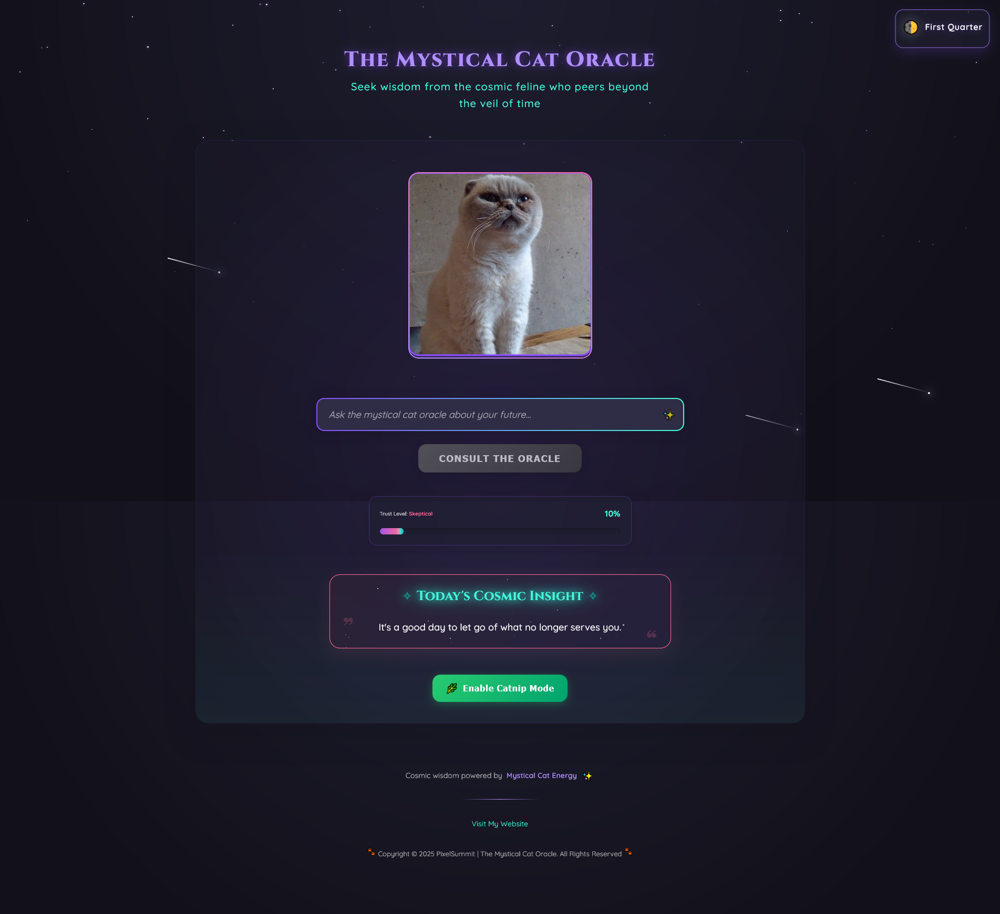

# 🐱 Mystical Cat Oracle

A whimsical, interactive fortune-telling app featuring a cosmic cat oracle (Chanel) who delivers fortunes. Built with React and Vite.



## ✨ Features

- **Interactive Fortune Telling**: Ask questions and receive cat-themed wisdom
- **Cosmic Visuals**: Particle effects, animations, and cosmic imagery
- **Trust System**: The more you consult the oracle, the more your "trust level" increases
- **Catnip Mode**: Toggle "catnip mode" for extra whimsical fortunes
- **Daily Fortune**: Receive a different daily cosmic insight each day
- **Moon Phase Indicator**: Displays the current moon phase and its mystical influence
- **Responsive Design**: Fully responsive for all device sizes
- **Animation**: Smooth transitions and playful effects throughout

## 🚀 Live Demo

Experience the oracle yourself: [Mystical Cat Oracle Live Demo](https://helpful-granita-5a0df4.netlify.app/)

## 🛠️ Technologies Used

- React 19
- Vite
- CSS Modules
- Local Storage for persistence
- SVG animations
- CSS custom properties
- Responsive design techniques
- Glass morphism effects

## 🔮 How It Works

1. Type your question into the input field
2. Click "Consult the Oracle" (or press Enter)
3. Watch as the mystical cat contemplates your question
4. Receive your cosmic, cat-themed fortune
5. Your trust level increases with each consultation
6. Toggle "Catnip Mode" for alternative fortune experiences

## 🔧 Installation & Setup

### Prerequisites
- Node.js
- npm or yarn

### Installation

1. Clone the repository
```bash
git clone https://github.com/leverh/cat-oracle-live
cd your-chosen-directory
```

2. Install dependencies
```bash
npm install
# or
yarn
```

3. Start the development server
```bash
npm run dev
# or
yarn dev
```

4. Open your browser and navigate to `http://localhost:5173`

### Building for Production

```bash
npm run build
# or
yarn build
```

This will generate optimized files in the `dist` directory.

## 📁 Project Structure

```
src/
├── App.jsx                # Main application component
├── global.css             # Global CSS variables and styles
├── components/            # UI components
│   ├── CatImage/          # Cat image with animations
│   ├── CatOracle/         # Main oracle container
│   ├── CatnipButton/      # Toggle for catnip mode
│   ├── CursorEffect/      # Custom cursor animations
│   ├── DailyFortune/      # Daily fortune component
│   ├── Footer/            # App footer with links
│   ├── FortuneDisplay/    # Fortune text display
│   ├── IntroOverlay/      # Welcome screen for first-time users
│   ├── MoonPhaseIndicator/# Moon phase display
│   ├── MysticParticles/   # Background particle effects
│   ├── QuestionInput/     # User input for questions
│   └── TrustMeter/        # Trust level indicator
├── hooks/                 # Custom React hooks
│   ├── useCatnip.js       # State management for catnip mode
│   └── useTrust.js        # Trust level management
├── data/                  # Static data
│   └── fortunes.js        # Cat-themed fortune text
└── assets/                # Static assets
    └── images/            # Cat images and backgrounds
```

## 🎮 User Experience

The Mystical Cat Oracle provides a playful yet mystical experience:

- **First Visit**: Users are greeted with an overlay explaining the oracle
- **Ask Questions**: Users can ask any question for guidance
- **Visual Feedback**: The cat "thinks" about the question before revealing insights
- **Personalized Experience**: Trust level grows over multiple visits
- **Daily Inspiration**: Even without asking, users receive a daily fortune
- **Cosmic Theme**: The entire UI features space imagery, particles, and cosmic elements

## 🧩 Component Overview

- **CatOracle**: Main component that orchestrates the application flow
- **CatImage**: Displays different cat images with mystical animations
- **FortuneDisplay**: Shows the fortune with animated visual effects
- **TrustMeter**: Displays the growing trust relationship with the oracle
- **MoonPhaseIndicator**: Shows the current moon phase and meaning
- **MysticParticles**: Creates the background particle effects
- **IntroOverlay**: Welcomes new users and explains the oracle
- **QuestionInput**: Accepts and processes user questions
- **CatnipButton**: Toggles between standard and "catnip" mode fortunes
- **DailyFortune**: Provides a daily cosmic insight

## 🔄 State Management

- User's questions and fortunes are managed in the CatOracle component
- Trust level is persisted using localStorage for returning users
- Catnip mode preferences are saved between sessions
- First-time visitor status is tracked for the intro overlay

## 🎨 Customization

You can easily customize the oracle by editing:

- **Color palette**: Modify CSS variables in `global.css`
- **Fortunes**: Edit the fortune texts in `data/fortunes.js`
- **Cat images**: Replace images in the `assets/images/cat-poses` directory
- **Moon phases**: Update meanings in the `MoonPhaseIndicator` component

## 📱 Responsive Design

The app is fully responsive across all device sizes:
- **Mobile**: Optimized layout with adjusted sizing
- **Tablet**: Balanced experience with medium-sized elements
- **Desktop**: Full experience with rich animations and effects


## 📄 License

This project's code is licensed under the MIT License.

**Special Note on Images:** The cat images used in this application are photographs of my personal pet and are **NOT** included in the open-source license. All cat photographs are copyright protected and may not be used, reproduced, distributed, or modified without explicit written permission. While you are welcome to fork and modify the code for your own projects, please replace the cat images with your own.

---

Created with ❤️ and cosmic cat energy by [PixelSummit](https://pixelsummit.dev/)

---

## 🐾 REMEMBER! 🐾

### 🏠 Adopt Don't Shop 🛍️

Every year, millions of wonderful animals wait in shelters for loving homes, while many others never get that chance. When you adopt, you're not just bringing home a pet – you're saving a life, creating space for another animal in need, and taking a stand against harmful breeding practices.

Shelter pets bring just as much love, loyalty, and companionship as any pet from a breeder or store. Each has their own unique personality and backstory, waiting for someone to give them a second chance. Many are already trained, vaccinated, and ready to become your perfect companion.

By choosing adoption, you'll experience the incomparable joy of watching a formerly homeless animal blossom in a loving environment – there's simply no feeling like the gratitude of a rescued pet. 🐱 🐶 🐰 💕

*Remember: When you adopt, you're not just changing an animal's life – they're changing yours too.*
